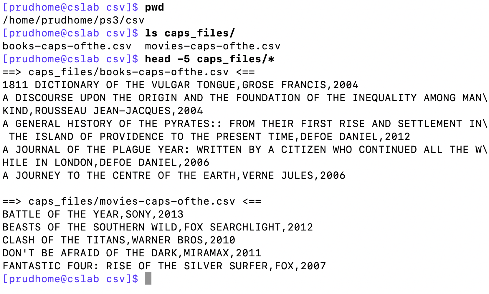
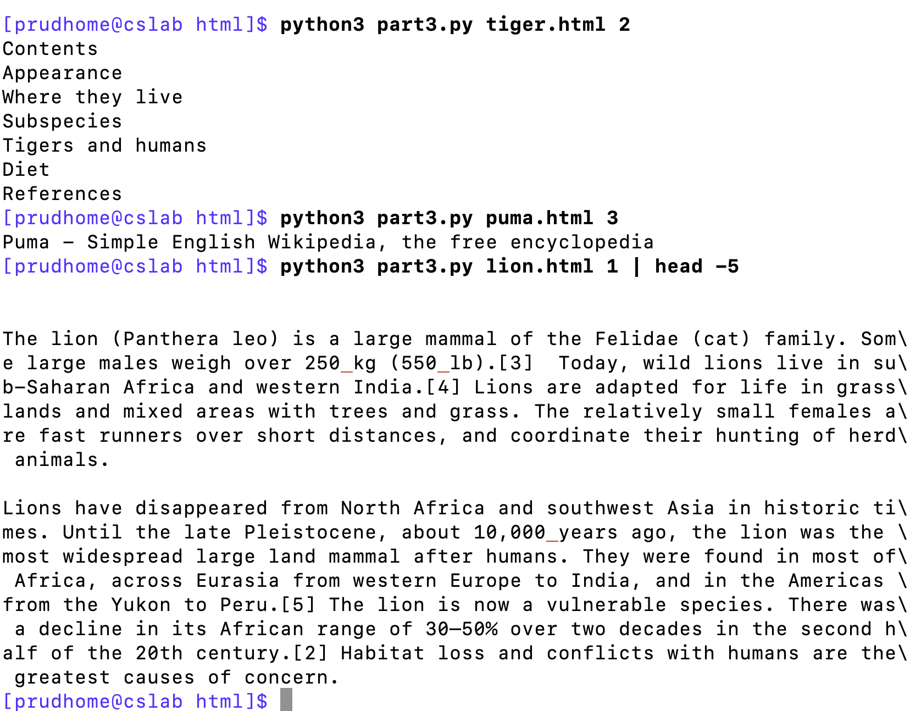

# Problem Set 3

For this problem set, you will submit a "tarball" (i.e., a `.tgz` file you create withe unix utility `tar`) of your copy of this repo after you have created several new files in different directories, as described below. At the end of the problem set, I'll explain how you should do this.

**This problem set is due on Canvas by Tuesday, October 10, by 11:59pm Boston time.**

---

### Getting started
Remember: the goals of this class are (among others) to become proficient in using a text editor, navigating a linux file system with unix commands, and running programs from a command line. I'd like you to do this assignment on `cslab`, and the easiest way to get all the files from here up to your account on `cslab` is to use `git`. 

1. Create an account on GitHub if you don't already have one: https://github.com/signup
2. Log into `cslab`.
3. Type the following command to "clone" this respository to your home directory on cslab.

```
git clone https://github.com/CSCI-2349-F23/ps3.git
```

4. Type `ls` and you'll see that you now have a directory in your home directory called `ps3`.

(For future problem sets, you'll just put a different URL after `git clone`. When viewing the repo in your web browser, click the green `Code` button in the upper right corner. This will display the URL, which you can copy and paste.)

5. If you `ls ps3`, you'll see that there is `README.md` (this file) and two subdirectories, `csv` and `html`, each of which has a few files. You'll be using these files as starter code and as input files in the different parts of this problem set.

### Part 1: Bash scripting with CSV files

1. Move into the `csv` directory. Write a single line with multiple commands in unix that will do the following for the file `movies.csv`: extract the 1st, 2nd, and 8th fields, upcase everything, pick out the lines that contain the phrase "OF THE", then sort alphabetically. You should have 29 lines, where the first 3 and last 3 lines are as shown below.

```
BATTLE OF THE YEAR,SONY,2013
BEASTS OF THE SOUTHERN WILD,FOX SEARCHLIGHT,2012
CLASH OF THE TITANS,WARNER BROS,2010
...
TRANSFORMERS: REVENGE OF THE FALLEN,PARAMOUNT,2009
UNDERWORLD: RISE OF THE LYCANS,SONY,2009
WRATH OF THE TITANS,WARNER BROS,2012
```

2. Create a bash script in the `csv` directory called `part1.sh`. Make sure the bash script has the important first line at the top. **Then paste in the command you wrote for #1 above.** Then run it from the terminal with `bash part1.sh` and make sure that it does the right thing.

3. Write a single line in unix that does the above for both csv files, then extracts just the first field (the movie or book title), then prints out how many time each movie or book title appears in both files, then sorts that by the number of times. **Add this line of code to `part.sh`.**

You should get 141 lines, and you should find exactly one book from the list that was made into a movie of the same name on this list.   These are the first and last three lines of my output:

```
      1 1811 DICTIONARY OF THE VULGAR TONGUE
      1 A DISCOURSE UPON THE ORIGIN AND THE FOUNDATION OF THE INEQUALITY AMONG MANKIND
      1 A GENERAL HISTORY OF THE PYRATES:: FROM THEIR FIRST RISE AND SETTLEMENT IN THE ISLAND OF PROVIDENCE TO THE PRESENT TIME
      ...
      1 UNDERWORLD: RISE OF THE LYCANS
      1 WRATH OF THE TITANS
      2 THE HOUND OF THE BASKERVILLES
```

4. Create a directory caplled `caps_files` in the `csv` directory. Now, at the end of `part1.sh`, use a `for` loop to go through each csv file, and for each file, apply the command you wrote for #1 and write the output to a new file in the `caps_files` directory whose name is the same as the input file but replaces `.csv` with `-caps-ofthe.csv`. For example, the output you got for #1 above applied to `movies.csv` would be redirected to a file called `movies-caps-ofthe.csv`. After running this code, I have two files in the `caps_files` directory. You can see their contents in the screenshot below.



Sources for these csv files:
* https://corgis-edu.github.io/corgis/csv/classics/
* https://github.com/reisanar/datasets/blob/master/HollywoodMovies.csv


### Part 2: Python with CSV files

1. Replicate Part 1 #4, above, with Python using as starter code the python program `part2.py`. This file contains code that is similar to what we wrote in class to write out a capitalized version of a file. Start with this code. **Make a copy and name it python program `part2_exercise1.py`.** *Note: You can use [`split()` on commas](https://www.w3schools.com/python/ref_string_split.asp) since I removed all commas from within the fields, or you can use the [csv library](https://docs.python.org/3/library/csv.html). The latter will be more useful in the long run, but either is okay!*

2. Replicate Part 1 #3, above, with Python. You can use your code for #1 as starter code. **Name this python program `part2_exercise2.py`.**


### Part 3: Python with HTML files

1. For this part, you will need to install the Beautiful Soup library. You won't be able to install just with `pip3 install` like you would on your own computer. On a server, you have to use the `--user` flag, like this:

```
python3 -m pip install --user beautifulsoup4
```

2. Now move into the the `html` directory. There are three HTML files from Simple English Wikipedia and some starter code in `part3.py` that extracts interesting information from an HTML files. Try running it to see what it does, and have a look at the HTML to make sure you understand what's going on. You should also look at the entry to Lion in Simple English Wikipedia.

3. Right now, `part3.py` is hard-coded to parse the file `lion.html`. Change the code in `part3.py` so that it gets the file to parse from the command line as the first command line argument. We've seen how to use `sys.argv` in class, and I am assuming you learned it in CS1.

4. Right now, `part3.py` prints out all the text, all the h2-level headings, and the title of the page. Rewrite the program so that the user calling the program can specify which one of these three things they want to print out as a second command line argument.

      * `1` = text
      * `2` = headings
      * `3` = title

5. Right now, the h2 headings have some extra text in them encolsed in square brackes. Use the `re` library to remove the square brackets and whatever text they contain before printing out the headings.

Here's a few example runs of the program in the screenshot below.


    

### Part 4: Combining Python with unix commands
Write a (very short) bash script in `part4.sh` that, loops through each html file, prints out each file name, then does the following by applying unix commands to the output of `part3.py`.

* Print out the number of lines of text containing the word "cat" or "cats" or "Cat" or "Cats".
* Print out the number of headings in the html file

This is what the output should look like:

```
lion.html      # the file name
4              # number of lines containing the word "cat" or "cats" or "Cat" or "Cats"
9              # number of h2 headings
puma.html
1
4
tiger.html
2
7
```

---

### Deliverable

You should end up with a `ps3` directory that looks like this with the new files you created in bold face. (I might have made an error, so I will update as needed.)

```
ps3 -- README.md
    -- caps_files.png
    -- htmltask1.png
    -- csv
       -- movies.csv
       -- books.csv
       -- **part1.sh**
       -- part2.py
       -- **part2_exercise1.py**
       -- **part2_exercise2.py**
       -- caps_files
          -- **movies-caps-ofthe.csv**
          -- **books-caps-ofthe.csv**
    -- html
       -- lion.html
       -- tiger.html
       -- puma.html
       -- **part3.py**
       -- **part4.sh**
```

Tar and zip that up into a single .tgz file as follows (assuming you cloned `ps3` to your home directory):

```
cd ~
tar czvf ps3.tgz ps3/
```

Scp `ps3.tgz` down to your own computer (demonstrated in the slides from a few weeks ago). Then upload `ps3.tgz` to Canvas as your submission to this problem set.

**This problem set is due on Canvas by Tuesday, October 10, by 11:59pm Boston time.**
